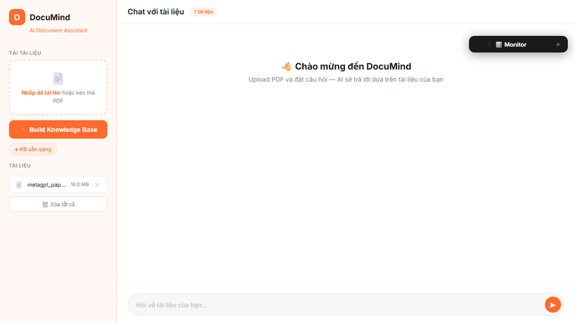

<div align="center">

# DocuMind 🧠

**AI-powered document assistant — Upload PDFs, ask questions, get intelligent answers.**

[](https://python.org)
[](https://fastapi.tiangolo.com)
[](https://github.com/geekan/MetaGPT)
[](https://groq.com)
[](LICENSE)

<br/>



*Upload your PDF documents → Build a knowledge base → Chat with your data*

</div>

---

## ✨ Features

| Feature | Description |
|---------|-------------|
| 📄 **PDF Upload** | Drag & drop or click to upload multiple PDF documents |
| ⚡ **One-Click KB Build** | Automatically index documents into ChromaDB vector store |
| 🧠 **3-Step AI Pipeline** | Analyze → Retrieve → Review for high-quality answers |
| 🇻🇳 **Vietnamese Support** | Responses automatically translated to Vietnamese |
| 💻 **Code Generation** | Detects code-related questions and includes working examples |
| 🔍 **Source Attribution** | Shows query type tags so you know how your question was processed |
| 🎨 **Custom UI** | Clean white + orange theme — no CSS frameworks, pure vanilla |

## 🏗️ Architecture

```
┌─────────────────────────────────────────────────────────────┐
│                        Browser (UI)                         │
│          static/index.html — Vanilla HTML/CSS/JS            │
└──────────────────────┬──────────────────────────────────────┘
                       │  HTTP (fetch API)
                       ▼
┌─────────────────────────────────────────────────────────────┐
│                   FastAPI  (main.py)                         │
│         /upload   /build   /chat   /status                  │
└──────────────────────┬──────────────────────────────────────┘
                       │  subprocess (isolated process)
                       ▼
┌─────────────────────────────────────────────────────────────┐
│               MetaGPT Agent Pipeline                        │
│                                                             │
│   ┌──────────────┐  ┌─────────────────┐  ┌──────────────┐  │
│   │ AnalyzeQuery │→ │RetrieveAndAnswer│→ │ ReviewAnswer  │  │
│   │  (classify)  │  │  (RAG + LLM)    │  │  (polish)     │  │
│   └──────────────┘  └────────┬────────┘  └──────────────┘  │
│                              │                              │
│                    ┌─────────▼─────────┐                    │
│                    │    RAG Engine      │                    │
│                    │ ChromaDB + BGE     │                    │
│                    └───────────────────┘                    │
└─────────────────────────────────────────────────────────────┘
                       │                │
              ┌────────▼──┐    ┌────────▼────────┐
              │  Groq API │    │  HuggingFace    │
              │ LLama 3.3 │    │ bge-small-en    │
              │   70B     │    │   (local)       │
              └───────────┘    └─────────────────┘
```

## 🛠️ Tech Stack

| Layer | Technology |
|-------|-----------|
| **LLM** | Llama 3.3 70B via [Groq](https://groq.com) (ultra-fast inference) |
| **Embedding** | [BAAI/bge-small-en-v1.5](https://huggingface.co/BAAI/bge-small-en-v1.5) (local, no API needed) |
| **Vector DB** | [ChromaDB](https://www.trychroma.com/) (persistent, local storage) |
| **Agent Framework** | [MetaGPT](https://github.com/geekan/MetaGPT) (multi-action Role pipeline) |
| **Backend** | [FastAPI](https://fastapi.tiangolo.com/) + Uvicorn |
| **Frontend** | Vanilla HTML / CSS / JavaScript (zero dependencies) |

## 🚀 Quick Start

### Prerequisites

- Python 3.11+
- [Groq API Key](https://console.groq.com/keys) (free tier available)

### 1. Clone & Setup

```bash
git clone https://github.com/Duon-gg/documind.git
cd documind

python -m venv venv
# Windows
venv\Scripts\activate
# macOS/Linux
source venv/bin/activate

pip install -r requirements.txt
```

### 2. Configure

```bash
cp .env.example .env
```

Edit `.env` and add your Groq API key:

```env
GROQ_API_KEY=gsk_your_key_here
```

Then initialize MetaGPT config:

```bash
metagpt --init-config
```

Edit `~/.metagpt/config2.yaml`:

```yaml
llm:
  api_type: "openai"
  model: "llama-3.3-70b-versatile"
  base_url: "https://api.groq.com/openai/v1"
  api_key: "gsk_your_key_here"
  context_length: 32768
  max_token: 4096
```

### 3. Add Documents

Drop your PDF files into the `data/` folder:

```bash
cp your-document.pdf data/
```

### 4. Run

```bash
uvicorn main:app --reload --port 8000
```

Open **http://localhost:8000** → Click **⚡ Build Knowledge Base** → Start chatting!

> **⚠️ Note:** This app requires ~2GB RAM due to PyTorch + MetaGPT + ChromaDB embeddings. Best run locally or on a paid cloud instance (Render free tier is insufficient).

## 📁 Project Structure

```
documind/
├── agents/
│   ├── __init__.py
│   ├── actions.py          # 3 MetaGPT Actions (Analyze, Retrieve, Review)
│   └── roles.py            # DocuMindAgent Role orchestrator
├── static/
│   └── index.html          # Frontend UI (single-file, zero deps)
├── data/                   # PDF documents (gitignored)
├── storage/                # ChromaDB vector store (gitignored)
├── main.py                 # FastAPI backend (4 endpoints)
├── rag_engine.py           # RAG pipeline (SimpleEngine + ChromaDB)
├── query_worker.py         # Subprocess worker (DLL isolation)
├── config2.yaml            # MetaGPT LLM config
├── requirements.txt        # Python dependencies
├── .env.example            # Environment template
└── README.md
```

## 💡 How It Works

When you send a question, DocuMind runs a **3-step agent pipeline**:

1. **🔍 AnalyzeQuery** — Classifies the question type (`explain` / `compare` / `code`), detects if code examples are needed, and refines the query for better retrieval.

2. **📚 RetrieveAndAnswer** — Searches the ChromaDB vector store using semantic similarity, retrieves relevant document chunks, and generates a draft answer via Groq LLM.

3. **✨ ReviewAnswer** — Quality-checks the draft, fixes formatting, adds missing context, and translates the response to Vietnamese.

> **Why subprocess isolation?** On Windows, PyTorch's DLL can only be initialized once per process. Since Streamlit/Uvicorn may re-import modules, we run the heavy AI pipeline in a separate Python process to avoid `WinError 1114` crashes.

## 📝 License

This project is licensed under the MIT License — see the [LICENSE](LICENSE) file for details.

## 👤 Author

**Duon-gg**

- GitHub: [@Duon-gg](https://github.com/Duon-gg)

---

<div align="center">

Built with using MetaGPT + Groq + ChromaDB

</div>
